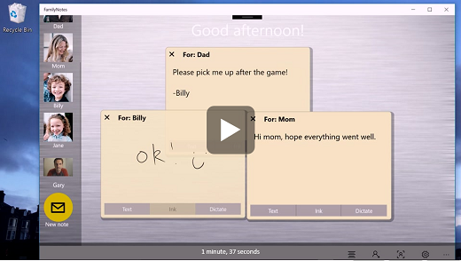
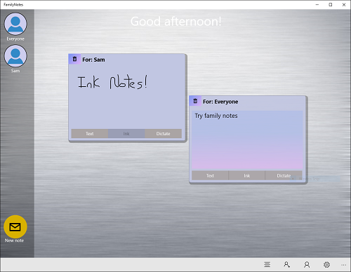

<!---
  category: AudioVideoAndCamera SpeechAndCortana Inking CustomUserInteractions AppSettings FilesFoldersAndLibraries Data
-->

# FamilyNotes sample

A mini-app that explores different input modalities and scenarios of user awareness. A bulletin-board app that allows family members 
to leave notes for each other on a common PC/tablet just like they would on a bulletin board. Using text, speech, ink, or pictures, 
a user can create a note and tag it for another user. Later when that other user approaches the PC/Tablet, the app uses imaging APIs 
and the Microsoft Cognitive Services (Face API) to detect their presence and display the notes that have been left for them, effectively 
filtering based on facial recognition. While the app is open, users can naturally interact with it using speech (“Add note for Bob”). 
If the app isn’t open, a user can easily launch it and interact with it using Cortana. 

This sample runs on the Universal Windows Platform (UWP). 

Be aware that the image understanding capabilities of the **FamilyNotes** app use Microsoft Cognitive Services. Microsoft will receive the images and other data that you upload (via this app) for service improvement purposes. To report abuse of the Microsoft Face APIs to Microsoft, please visit the Microsoft Cognitive Services website at www.microsoft.com/cognitive-services, and use the “Report Abuse” link at the bottom of the page to contact Microsoft. For more information about Microsoft privacy policies please see the privacy statement here: http://go.microsoft.com/fwlink/?LinkId=521839.

## Features

The FamilyNotes app demonstrates:

* Speech recognition and speech synthesis by using the [SpeechRecognizer](https://msdn.microsoft.com/library/windows/apps/windows.media.speechrecognition.speechrecognizer.aspx) and [SpeechSynthesizer](https://msdn.microsoft.com/library/windows/apps/windows.media.speechsynthesis.speechsynthesizer.aspx) classes.  
* User detection using the [MediaCapture](https://msdn.microsoft.com/library/windows/apps/windows.media.capture.mediacapture.aspx) and [FaceDetectionEffect](https://msdn.microsoft.com/library/windows/apps/windows.media.core.facedetectioneffect.aspx) classes.  
* User facial recognition using the [Microsoft Face API](http://www.microsoft.com/cognitive-services/en-us/face-api).
* Activation through Cortana voice commands, defined in VoiceCommands.xml (a [VCD](https://msdn.microsoft.com/library/windows/apps/dn706593) file), using [VoiceCommands](https://msdn.microsoft.com/library/windows/apps/Windows.ApplicationModel.VoiceCommands.aspx) and [Activation](https://msdn.microsoft.com/en-us/library/windows/apps/windows.applicationmodel.activation.aspx) classes.
* Pen input using the [InkCanvas API](https://msdn.microsoft.com/en-us/library/windows/apps/windows.ui.xaml.controls.inkcanvas.aspx)
* JSON serialization using the [DataContractJsonSerializer](https://msdn.microsoft.com/en-us/library/system.runtime.serialization.json.datacontractjsonserializer.aspx) class.
* Setting the app wallpaper using the [Bing image of the day task snippet](https://github.com/Microsoft/Windows-task-snippets/blob/master/tasks/Bing-image-of-the-day-URI.md).

## Universal Windows Platform development

This sample requires Visual Studio 2015 and the Windows Software Development Kit (SDK) for Windows 10.

[Get a free copy of Visual Studio 2015 Community Edition with support for building Universal Windows apps](http://go.microsoft.com/fwlink/?LinkID=280676)

Additionally, to be informed of the latest updates to Windows and the development tools, join the [Windows Insider Program](https://insider.windows.com/ "Become a Windows Insider").

## Running the sample

The default project is FamilyNotes and you can Start Debugging (F5) or Start Without Debugging (Ctrl+F5) to try it out. The app will run in the emulator or on physical devices, though functionality related to speech and face recognition is dependent on hardware support and the app has not yet been designed for a phone layout.

## Requirements 

* **User filtering by facial recognition requires:**
  * A front-facing camera or USB webcam.
  * A subscription key for the Microsoft Face API. For information about getting a free trial key, see the Microsoft Cognitive Services site.
  * A user created with a profile picture for your phase, or an user you want to be recognized.  
    **Note:** The Microsoft Face API subscription key must be entered in the Settings menu of the app before facial recognition can be used. The settings menu is opened by clicking the gear button on the apps command bar.
* **Speech recognition requires:**
  * A microphone and the appropriate settings enabled on the local machine.
* **Cortana requires:**
  * The app must be launched once to register the Cortana voice commands for subsequent activation through Cortana.
  * The Cortana voice command phrase list is updated dynamically whenever a family member is added or removed.

## Articles

The FamilyNotes app illustrates a number of platform features. For more detailed articles about those features and their use within the app, see the following articles.
* [Data bind an InkCanvas control](DatabindInkCanvas.md)
* [Serializing the model and InkCanvas data](Serialization.md)
* [Using speech for note taking](Speech.md)
* [Using the camera, imaging, and the Microsoft Cognitive Services (Face API) for facial recognition](CameraImagingRecognition.md)

Also, some additional discussion and information about the sample is available on the Windows Developer blog in the following posts.
* [FamilyNotes: Introducing a Windows UWP sample using ink, speech, and face recognition](https://blogs.windows.com/buildingapps/2016/06/21/familynotes-introducing-a-windows-uwp-sample-using-ink-speech-and-face-recognition/)  
* [FamilyNotes: Using the camera to detect a user](https://blogs.windows.com/buildingapps/2016/06/28/familynotes-using-the-camera-to-detect-a-user/)  
* [FamilyNotes: (Spoken) words and pictures](https://blogs.windows.com/buildingapps/2016/07/05/familynotes-spoken-words-and-pictures/)  

## Code at a glance

If you are interested in code snippets and don’t want to browse or run the full sample, check out the following files for examples of some highlighted features:

* [Settings.cs](FamilyNotes/Settings.cs) : Downloads the Bing image of the day and allows for app config such as storing the developer key for the Microsoft Face API.
* [BindableInkCanvas.cs](FamilyNotes/Controls/BindableInkCanvas.cs) : An `InkCanvas` control with a bindable `InkStrokeContainer`.
* [Utils.cs](FamilyNotes/Utils.cs) : Delete a directory and its contents.
* [App.xaml.cs](FamilyNotes/App.xaml.cs) : Saves/loads the people and their notes. Demonstrates serialization and how to handle saving multiple `InkStrokeContainers` to a stream.
* [AddPersonContentDialog.xaml.cs](FamilyNotes/AppDialogs/AddPersonContentDialog.xaml.cs) : Contains the add person dialog, which has an option to take a snapshot for a user when adding him or her. This picture is taken using the [CameraCaptureUI](https://msdn.microsoft.com/en-us/library/windows/apps/windows.media.capture.cameracaptureui.aspx).
* [UserPresence.cs](FamilyNotes/UserDetection/UserPresence.cs) : Contains the code that is responsible for taking pictures in the background. These pictures are then used for user identification.
* [FacialSimilarity.cs](FamilyNotes/UserDetection/FacialSimilarity.cs) : Contains the code used to interact with the Microsoft Face APIs for the purpose of comparing a dynamically captured user image against a list of known users to obtain the most likely user present.

## See also

[Microsoft Cognitive Services](http://www.microsoft.com/cognitive-services)  
[Microsoft Cognitive Services samples](https://www.microsoft.com/cognitive-services/en-us/sdk-sample?author=microsoft&category=sample)  
[Cortana interactions](https://msdn.microsoft.com/en-us/windows/uwp/input-and-devices/cortana-interactions)  
[Cortana voice command sample](http://go.microsoft.com/fwlink/p/?LinkId=619899)  
[Pen and stylus interactions](https://msdn.microsoft.com/en-us/windows/uwp/input-and-devices/pen-and-stylus-interactions)  
[Simple ink sample](http://go.microsoft.com/fwlink/p/?LinkID=620312)  
[Complex ink sample](http://go.microsoft.com/fwlink/p/?LinkID=620314)  
[Speech recognition and synthesis sample](https://github.com/Microsoft/Windows-universal-samples/tree/master/Samples/SpeechRecognitionAndSynthesis)  
